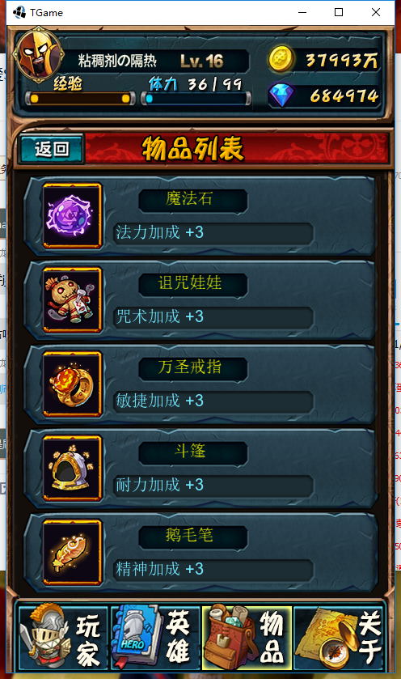

## 存档状态
正在开发。

##egret-libgdx
* 在libGDX中使用Egret编辑器
* 参考[CHGameFrameJava](http://git.oschina.net/oahcfly/CHGameFrame)对Egret的解析。

## 展示
* 在线浏览[http://sedn.egret.com/examples/DemoEUI_2/release/index.html](http://sedn.egret.com/examples/DemoEUI_2/release/index.html)

##特性
* 支持最新版的[Egret Wing](http://developer.egret.com/cn/)进行开发
* 仅支持Egret Wing的格式
* 支持Egret Wing中大部分控件

## 快速入门
本项目目前没有发布正式版本，只有下载代码。

## 源码构建
项目使用gradle管理，直接运行`./gradlew build`即可。导入源码 运行即可

##有问题反馈
在使用中有任何问题，欢迎用以下方式进行反馈

* 在Github中直接创建一个issue
* QQ群：[187378034](http://shang.qq.com/wpa/qunwpa?idkey=bbd0f15c6ba62dae8479d69dfcdce3816c18c684521b84a6ba4b7ce03a70d126)
* QQ: 634416025

## 下一步计划
+ 完善egret其他控件
+ 期待各位libgay的加入.